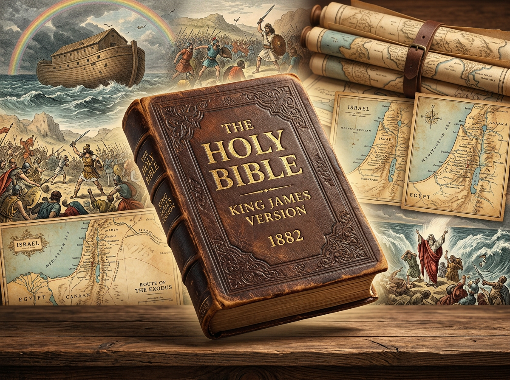

# Immersive-Bible-Reader
An intelligent &amp; adaptive Holy Bible Reader tailored specifically for ancient texts. It goes beyond simple OCR processing and enters the realm of complex document understanding, layout analysis, semantic linking &amp; Multi Modal AI Generation. As you read, the reconstituted and scalable text comes alive with relevant images and maps dynamically.

A wonderful companion to your historic early release print version, but now it contains more details than was previously possible. Comprehensive semantic linking covers everything to the smallest detail. Newly synthesized charts, maps, tables and images of every key figure and event in the entiretly of the holy text are vividly brought to life for reading pleasure. Before this it was merely flat text. Now you have access to the Immersive-Bible-Reader. Where no generated content is currently available, the original artwork is used as a fallback. Much more is planned, so keep watching this space !
